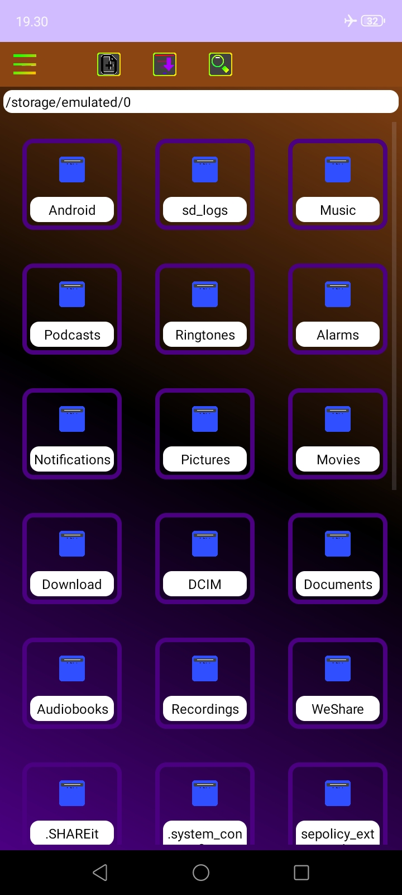
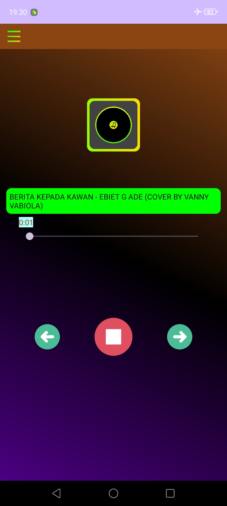
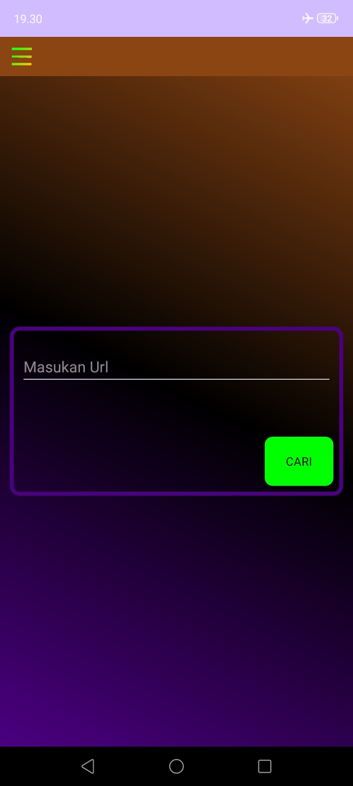

# Fahalwan app

ini adalah aplikasi pribadi.
dengan fitur awal adalah pengelolaan berkas.
dan mungkin akan terus berkembang seiring waktu

## SCREENSHOOT

## Mengunduh Aplikasi
[LINK DOWNLOAD]([https://github.com/iqbalfahalwan/Fahalwan/app/build/outputs/apk/debug/app-debug.apk)
